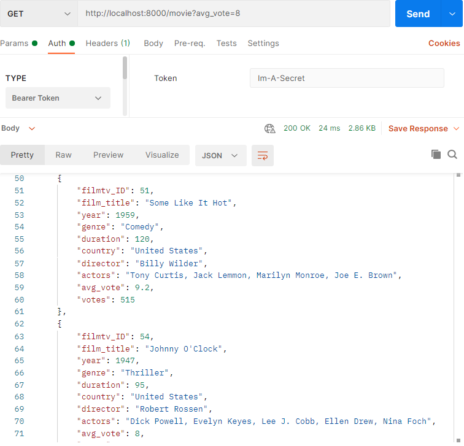

# Moviedex Api

The moviedex api is a Thinkful excersise meant to give me experience creating / testing my own secure api. 

## Using the Query Parameters
The client can search the provided movie index by genre, country, or average vote using query string parameters. 

<table>
<tr>
<td valign="top" width="33%">
<h2 align="center">By Genre</h2>

A movie will be sent in response if its genre value contains the string provided by a 'genre' query

</td>
<td valign="top" width="34%">
<h2 align="center">By Country</h2>

A movie will be sent in response if its country value contains the string provided by a 'country' query

  
</td>

<td valign="top" width="33%">
<h2 align="center">By Average Vote</h2>

A movie will be sent in response if its average vote is higher than or equal to the number provided by an 'avg_vote' query

</td>
</tr>
</table>

## Sample The Api

This project was never published anywhere, but you can use it by following these steps:

1. View the repository and download the zip to your computer
2. extract the files and open the extracted folder in VsCode
3. open a terminal and run the command `npm install && npm start`. This will get the api server up and running!
4. now run the command `echo API_TOKEN='a-string-of-your-choice' >> .env`. This will get you past general security.
4. make all fetch requests to http://localhost:3000/movie with the authorization header `Bearer ${API_TOKEN}` or just copy the string to use in postman.

You can sample the api by making requests from https://web.postman.co/home, or create a client of your own! Whatever you try, I hope you have fun doing it.
